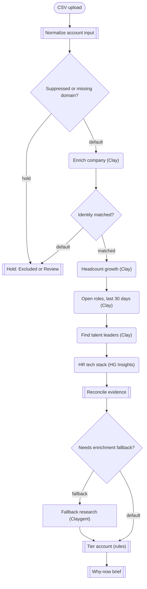

# Eightfold | Demand Gen Account Intelligence POC

Built through the Clay CLI (v1.9.0) in the **Clay Demos (GTM)** workspace, following the
"Eightfold | Native-First Clay CLI Workflow Build Guide".

- Workflow: https://app.clay.com/workspaces/91642/terracotta/tc-workflows/wf_0tmifho4eBDYwHsHv9r
- Status: **draft, not published**. Trigger is a CSV upload (`41a7c1f3-68ff-41d4-bca7-3430af0dfbca`)
  linked to `data/eightfold-top-icp-seed.csv` (25 accounts).
- Tested: 1 probe row and the first 10 seed rows. All 11 runs completed, no failed nodes.
- Node code: `clay/eightfold/*.py`. Fallback Claygent spec: `clay/eightfold/fallback-claygent-node.json`.
- Test output: `data/eightfold-test-batch-10.csv`.

Canvas groups: **Identity and suppression** (n1–n5), **Native research** (n6–n9),
**Qualify and brief** (n10–n14).

## How it maps to the build guide

| Guide section | Built as |
| --- | --- |
| 3. Seed and identity | Normalize code node (domain, tri-state customer and do-not-contact flags), then a rules gate that holds suppressed or domain-less rows **before** paid enrichment, and an identity gate on the Clay company match |
| 5. Native enrichment | Clay company enrichment, headcount growth, open roles in the last 30 days and talent-leader people search (all Companies, People, Jobs actions), plus HG Insights tech stack filtered to HCM and ATS products |
| 6. Claygent only for gaps | Runs only when native sources left the talent leader, the leader's start date or the HCM missing. Its values are promoted only when native data was empty **and** it cited a source URL with Low or Medium uncertainty |
| 7. Tier with rules | Python scorecard (industry 25, headcount 20, open roles 25, HCM 20, geography 10). Unknown stays unknown, and `Review` is used when an unknown field alone would decide the tier. `score_version` is `eightfold-fit-v0.1-calibration` |
| 9. Why-now | A fixed template, no AI. It cites the leader who started within 18 months and that person's profile URL, or says "Fit-led account; no verified recent trigger" |

Field paths from tool nodes are `$.result.<field>`. The test runs confirm this, and it matches
the current `workflows` skill in clay-run/agent-plugins, not the `$.toolResult.result` path
the build guide describes as a correction.

## Test batch (first 10 seed rows)

| Account | Tier | Leadership change within 18 months | Open roles (30d) | Notes |
| --- | --- | --- | --- | --- |
| UnitedHealth Group | Tier 1 | Raynee Meyer, CPO, UHC Operations (2025-09) | 52 | Matches the guide's appendix |
| State Farm | Tier 1 | none | 276 | Leader start date returned as a year only |
| KLA | Tier 1 | none | 1,171 | CHRO in role since 2006 |
| Walmart | Tier 1 | none | 34,739 | |
| Lockton | Tier 1 | Jonathan Collett, Head of Talent Intelligence (2026-01); Jennifer Villa, AVP TA (2026-07) | 345 | Collett matches the appendix |
| CVS Health | Tier 1 | Jeff Ehrenberg, SVP HR (2025-11) | 13,288 | |
| Flex | Tier 1 | none | 1,351 | |
| JPMorganChase | Tier 1 | Shirley Matthew, VP Talent Acquisition (2026-01) | 6,706 | |
| Johns Hopkins Medicine | Tier 1 | none | 105 | Talent leader filled by the Claygent from a Dec 2016 hopkinsmedicine.org article (Medium uncertainty), so "still current" is not proven |
| Nike | Tier 1 | Katrina Boshuizen, Head of People Analytics (2025-12) | 890 | |

Metered usage: 353 data credits across the 10 runs (about 40 per account; HG Insights
charges per install record returned).

## Known gaps

- **Every test account scored 100 / Tier 1.** The seed was pre-filtered to Eightfold's ICP, so
  the illustrative scorecard does not separate these accounts. Use it as a calibration starting point only,
  until Emi, Sue and Yash agree the real ICP thresholds.
- **Intent and engagement are not wired.** No intent-data or Marketo connection was set up, so
  those scores are placeholders kept separate from fit, as the guide requires.
- **No Salesforce or Audiences writeback** and **no Signals created**. Both are left for approval.
- **The why-now fix is not yet re-run.** After the batch, the brief was changed to cite the
  recently started leader rather than the long-tenured one (it was wrong for JPMorganChase,
  Lockton and Nike). Re-testing it needs a run approval.
- **Customer status is unknown for every seed row.** Without Eightfold's Salesforce export, the
  exclusion gate cannot remove existing customers.
